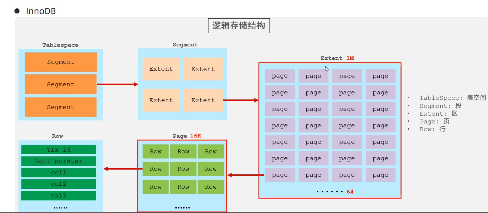

# 背景
在 Google 早期，随着其搜索引擎和各项服务数据量的爆炸式增长，传统的文件系统已经无法满足其日益严苛的需求。为了应对海量数据的存储和处理挑战，Google 内部设计并实现了一个高度可扩展、高可用且容错的分布式文件系统——Google 文件系统 (GFS)。GFS 的设计理念和技术实践深刻影响了后续 Hadoop HDFS 等一系列大数据存储系统。

GFS 的设计基于以下核心需求和假设：

*   **硬件不可靠性常态化：** 系统由大量廉价的商用硬件构建，这些组件的故障是常态，而非异常。因此，系统必须具备强大的故障监控、检测和自动恢复能力。
*   **存储重心在大文件：** GFS 主要面向大文件（GB 乃至 TB 级别）存储进行优化，例如 Web 爬虫数据、搜索引擎索引、视频文件等。虽然支持小文件，但并非其优化重点。
*   **工作负载特性鲜明：**
    *   **读取模式：** 以**大型流式读取**（一次性读取大量连续数据）为主，也支持小型的随机读取。
    *   **写入模式：** **大型追加写入**（将数据追加到文件末尾）是主要场景，文件写入后很少被修改。小写入也支持，但效率不高。
*   **高并发追加需求：** 系统必须高效地为并发追加到同一文件的多个客户端实现定义良好的语义。例如，文件常被用作**生产者-消费者队列**（多个生产者并发写入文件末尾，消费者从文件头部读取），这要求并发写入时每个操作都能保证原子性。
*   **高带宽优先于低延迟：** 对于大多数目标应用（如批处理任务），持续的高数据传输带宽远比单次操作的低延迟更为重要。系统更侧重于批处理数据的高吞吐量，而非单个读写的响应时间。

# 具体设计
## 架构设计

*图1: GFS 集群架构概览*

一个 GFS 集群由以下几个核心组件构成：
*   **单个 Master 服务器：** GFS 集群的核心。Master 负责维护整个文件系统的元数据，包括：
    *   文件和目录的命名空间（文件的层次结构）。
    *   文件到块 (Chunk) 的映射（文件被分成多个固定大小的块，默认 64MB）。
    *   块副本的位置（每个块在哪个 Chunkserver 上有副本）。
    *   租约 (Lease) 管理，用于协调并发写入。
    *   **元数据持久化：** Master 的元数据并非完全不持久化。实际上，**所有元数据变更都会被记录到操作日志 (Operation Log) 中并持久化到本地磁盘，同时这些日志还会被复制到远程机器**。Master 在启动时，会通过回放操作日志并扫描 Chunkserver 来重建其内存中的元数据状态。
*   **多个 Chunkserver：** 负责存储实际的用户数据块（Chunk）。Chunkserver 简单地以 Linux 文件系统文件的形式存储 Chunk，并根据 Master 的指令进行读写操作。
*   **多个 Clients：** 客户端应用程序通过 GFS 客户端库与 Master 和 Chunkserver 交互来访问 GFS。
## 一致性模型
GFS 的一致性模型是其设计哲学的体现，它为大规模分布式环境下的高并发追加写入场景做了实用主义的权衡。

*   **文件命名空间操作：** （例如文件创建、删除）由 Master 独家处理，保证**原子性**和**全局总序**。Master 的操作日志定义了这些操作的全球一致性顺序。
*   **数据操作：**
    *   **已定义 (Defined) 区域：** 如果一个数据区域是在没有并发写入干扰的**单个成功修改**后形成的，那么它就是“已定义”的。所有客户端将始终看到该修改所写入的完整内容。
    *   **未定义但一致 (Undefined but Consistent) 区域：** 当**多个并发写入**操作成功地修改了同一个文件区域时，该区域被认为是“未定义但一致”的。这意味着所有客户端看到的**数据是相同的**，但这些数据可能来自多个并发写入的**混合片段 (mingled fragments)**。GFS 认为某些应用能够容忍并处理这种混合结果（例如，通过在应用层识别并处理数据）。
    *   **不一致 (Inconsistent) 区域：** 任何**失败的修改**操作都可能使文件区域变为“不一致”状态，即不同的客户端在不同时间可能看到不同的数据。
*   **记录追加 (Record Append) 的特殊性：**
    *   这是 GFS 实现高并发追加写入的关键。与传统文件系统客户端指定偏移量写入不同，客户端只提交一条“记录”给 GFS。
    *   **偏移量由 GFS 决定：** GFS 会在文件末尾选择一个合适的偏移量来原子地追加该记录，并返回给客户端。这避免了客户端在并发场景下进行复杂的协调和锁争用，将并发处理的复杂性转移到 GFS 内部。
    *   **“至少一次”语义：** GFS 承诺每个记录会被**至少追加一次**。这意味着在某些故障恢复场景下，一条记录可能会在文件末尾出现**重复**。此外，GFS 也可能为了对齐和原子性，在记录之间插入**填充数据 (padding)**。
    *   **应用程序责任：** 为了处理这些 GFS 带来的特性，使用“记录追加”的应用（尤其是消费者）需要：
        *   在每条记录内部包含**唯一标识符**（如消息 ID），以便在读取时进行去重。
        *   理解文件可能包含**填充数据**，并编写逻辑来跳过它们。
        *   **不依赖**并发追加的绝对顺序，如果顺序很重要，需在应用层自己添加序列号。
    *   这种设计牺牲了传统文件系统的严格“恰好一次”和精确顺序保证，换取了**高并发写入的吞吐量和原子性**。

这里我们解释一下论文中介绍的当操作后一个区域的状态
- 串行 write
  - 成功 因为 Write 天然具有幂等性，因此即使中间失败重试也不会导致不一致，所以是 consistent 和 defined
  - 失败 那无需多言，inconsistnet
- 并行 write
  - 成功 多个写可能会出现相互覆盖，因此是 consistent 和 undefined
  - 失败 inconsistent
- 串行/并行 append
  - 成功 defined 但是 可能 inconsistent 对于单个操作来说，可能会出现你append abc 出现的结果是 abcabcabc，它是不幂等的，但是因为对于所有副本来说，它的最后那个位置一定是都插入上的，所以说是 defined 中间有一些 inconsistent，并行也是一样，append 就是为了并发而出现的。

## 控制流
GFS 通过“租约 (Lease)”机制来协调对 Chunk 的修改顺序，确保副本之间的一致性。

*图2: GFS 数据写入和控制流示意图*

当客户端需要修改一个 Chunk 时，其控制流如下：

1.  **租约获取：** 客户端首先向 Master 询问哪个 Chunkserver 持有该 Chunk 的当前租约（即 Primary Chunkserver）以及其他副本的位置。如果当前没有 Chunkserver 持有租约，Master 会将其选择的 Chunkserver 授予租约。
2.  **Master 回复：** Master 回复 Primary Chunkserver 的身份以及所有其他副本（Secondary Chunkserver）的位置。客户端会缓存此信息，以备将来的修改。只有当 Primary 不可访问或租约过期时，客户端才会清除缓存并重新向 Master 请求。
3.  **数据推送（流水线式）：** 客户端将待写入的数据推送到所有副本（包括 Primary 和 Secondary）。数据推送采用**线性拓扑**（例如，客户端推给 A，A 推给 B，B 推给 C），以最小化网络流量开销。这种数据流与控制流分离的设计，允许数据在 Chunkserver 之间以流式方式传输，提升了吞吐量。
4.  **写入请求发送：** 一旦所有副本都确认收到了数据，客户端就会向 Primary Chunkserver 发送写入请求，指示它开始执行写入操作。
5.  **Primary 执行与转发：** Primary Chunkserver 执行写入操作，并将其**转发**给所有 Secondary 副本。
6.  **Secondary 完成确认：** 所有 Secondary 副本完成写入后，向 Primary 确认。
7.  **Primary 回复客户端：** Primary 收到所有 Secondary 的确认后，向客户端回复写入完成。

### 快照 snapshot
GFS 的快照操作能够几乎瞬间地复制文件或目录树（“源文件/目录”），同时最大限度地减少对正在进行的修改的干扰。

*   **用户场景：** 用户利用快照快速创建大型数据集的**分支副本**（常用于数据分析、数据处理），或者在进行实验性修改之前创建**检查点**，以便后续可以轻松提交或回滚。
*   **实现机制：** GFS 采用标准的**写时复制 (Copy-on-Write, CoW)** 技术实现快照。
    *   **创建快照：** 当 Master 收到快照请求时，它首先**撤销**源文件或目录树所涉及的所有 Chunk 的租约。这确保了后续对这些 Chunk 的写入都需要 Master 的介入。
    *   **元数据复制：** 租约被撤销或过期后，Master 将快照操作记录到日志中并持久化，然后在内存中**复制源文件的元数据**。重要的是，新创建的快照文件（副本）的元数据会**指向与源文件完全相同的底层数据块 (Chunk)**。此时并没有实际的数据复制发生。
    *   **第一次写入触发复制：** 当客户端第一次尝试写入一个被快照共享的 Chunk 时，Master 会检测到该 Chunk 的引用计数大于一。Master 会延迟响应，并指示原 Chunkserver 创建一个**新 Chunk 的副本**。这个新副本只包含旧 Chunk 的数据。由于新 Chunk 在与原 Chunk 相同的 Chunkserver 上创建，数据可以在本地高效复制（无需通过网络传输）。一旦新 Chunk 创建完成，Master 会将写入权限授予客户端，客户端就可以像操作普通 Chunk 一样进行写入，而无需知道背后的 CoW 机制。

# 参考资料
- [The Google File System(2003)](https://static.googleusercontent.com/media/research.google.com/zh-CN//archive/gfs-sosp2003.pdf)
- [大数据基础笔记(3)：思考GFS的一致性设计](https://juejin.cn/post/7015226915392847902)

