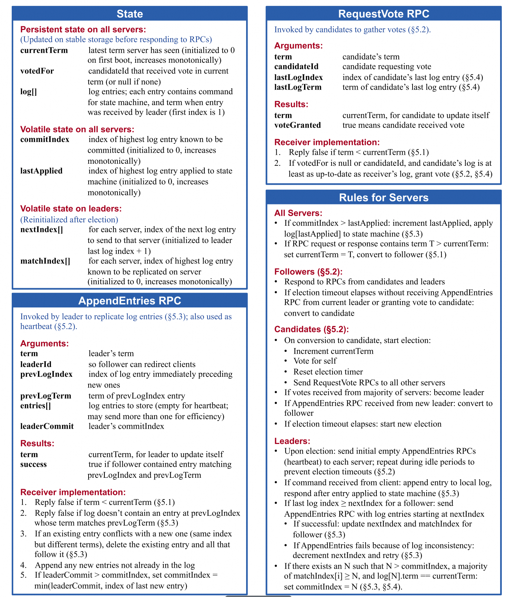

## Lab3 Raft实现
### 3A
3A 主要是不考虑状态机的情况下，实现 Raft Leader选举和心跳机制，确保选举出单一 Leader，如果没有故障就保持 Leader，如果 Leader 故障或者包丢失，则选举新的 Leader
#### ticker实现
我们需要实现超时机制，在一定时间后没有心跳，则我们需要进行选举
#### 选举实现

*状态转移*

*API 参考*
具体实现参照原论文中状态转移和 API 定义即可，需要注意的点如下
- 在向其他服务器发送 RequestVote 时，需要将锁释放，不然有可能出现多个 Candidater相互要票却无法投票的情况，因为投票也需要加锁，所以会产生死锁
- 在一台服务器决定是否投票时，如果收到的 Term 大于自身 CurrentTerm，需要更新自身 Term 并更新 VoteFor(我没更新 VoteFor 卡了好久)，因为没更新 VoteFor 会导致它进入下一个 Term 但是不能投票的情况出现，进而导致选举不出 Leader
- 发送心跳时也尽量不要锁整个函数，如果出现特殊情况也可能导致死锁，出现两个 Leader 虽然不是同一 Term 但有可能相互要锁导致死锁。

#### Log Replication(日志复制)
一次操作的控制流如下
- 客户端调用我们提供的 Start(command)
- Leader 将 command 追加到 log
  - 后台向其他 server 发送 AppendEntries，超过 n/2 个 server 后更新 commitIndex，后台异步进行 apply
  - commitIndex 是根据每次 AppendEntries 进行更新的，事实上 commit 这个操作并没有实质性对 log 的操作，只是修改了 commitIndex 用于提交
- 后台异步进行 apply(使用定时任务或条件变量(即只在 commitIndex 更新时通知 apply))

##### 一些bug
进行 AppendEntries 时写出了这样的代码
```go
    args[i] = AppendEntriesArgs{
			Term:         rf.currentTerm,
			LeaderId:     rf.me,
			PrevLogIndex: rf.nextIndex[i] - 1,
			PrevLogTerm:  rf.log.entries[args[i].PrevLogIndex].Term,
			Entries:      logEntry,
			LeaderCommit: rf.commitIndex,
		}
```
这里因为在args[i]初始化之前只是分配了内存，所以args[i].PrevLogIndex在赋值是恒为 0，就会导致Follower 虽然 log 和 Leader 相同，但是收到的logTerm 是 0，因此不能进行 appendEntries

在log的 struct 中将 LastTerm 写成了 lastTerm,进行 rpc 是传递的为 0，导致虽然日志一样，但无法给 leader 投票

